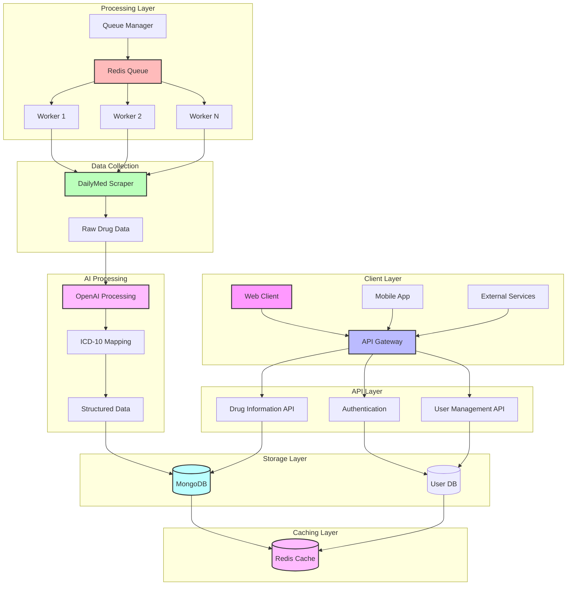

# DailyMed API

A RESTful API for managing drug information with user authentication and role-based access control.

## Development with Dev Container

### Prerequisites

- [Docker](https://www.docker.com/products/docker-desktop)
- [Visual Studio Code](https://code.visualstudio.com/)
- [Remote - Containers](https://marketplace.visualstudio.com/items?itemName=ms-vscode-remote.remote-containers) VS Code extension


## System Architecture



### System Flow Description

1. **Client Layer**
   - Web clients, mobile apps, and external services interact with the API
   - All requests go through the API Gateway for routing and rate limiting

2. **API Layer**
   - **Authentication API**: Handles user registration, login, and JWT management
   - **Drug Information API**: Provides endpoints for drug data access
   - **User Management API**: Manages user roles and permissions

3. **Processing Layer**
   - **Queue Manager**: Distributes drug data processing tasks
   - **Redis Queue**: Manages job distribution and worker coordination
   - **Workers**: Multiple worker processes for parallel data processing
     - Each worker can handle multiple tasks
     - Auto-scaling based on queue size

4. **Data Collection**
   - **DailyMed Scraper**: Extracts drug information from DailyMed
   - Handles rate limiting and retry logic
   - Stores raw data for processing

5. **AI Processing**
   - **OpenAI Integration**: Processes drug indications
   - **ICD-10 Mapping**: Maps indications to standardized codes
   - Generates structured, queryable data

6. **Storage Layer**
   - **MongoDB**: Stores processed drug data and mappings
   - **User Database**: Manages user accounts and roles
   - Implements data validation and indexing

7. **Caching Layer**
   - **Redis Cache**: Improves response times
   - Caches frequently accessed data
   - Manages session data

### Scalability Features

- **Horizontal Scaling**
  - Multiple API instances behind load balancer
  - Worker pool auto-scaling
  - Distributed caching

- **Performance Optimization**
  - Asynchronous processing
  - Data caching
  - Connection pooling
  - Rate limiting

- **Reliability**
  - Queue-based processing
  - Retry mechanisms
  - Error handling
  - Data validation

- **Security**
  - JWT authentication
  - Role-based access control
  - Rate limiting
  - Input validation

## Features

- User authentication (register/login)
- Role-based access control (admin/normal users)
- Drug information management
- RESTful API with Swagger documentation
- MongoDB database integration
- Redis caching
- JWT authentication
- Input validation
- Error handling

## Prerequisites

- Node.js (v18 or higher)
- MongoDB (v6 or higher)
- Redis (v7 or higher)
- npm or yarn

## Development Setup

1. **Clone the repository and open in VS Code**
```bash
git clone <repository-url>
cd dailymed
code .
```

2. **Open in Dev Container**
   - When VS Code opens, click "Reopen in Container" in the notification
   - Or use the command palette (F1) and select "Remote-Containers: Reopen in Container"
   - Wait for the container to build (first time only)

3. **Dev Container Features**
   - Pre-configured development environment
   - MongoDB and Redis services included
   - Node.js and npm pre-installed
   - Git, curl, and other development tools
   - VS Code extensions pre-installed:
     - ESLint
     - Prettier
     - Jest Runner
     - MongoDB for VS Code
     - Docker

4. **Available Services**
   - API Server: `http://localhost:3000`
   - MongoDB: `mongodb://localhost:27017`
   - Redis: `redis://localhost:6379`
   - MongoDB Express (Web UI): `http://localhost:8081`

5. **Development Workflow**
   ```bash
   # Inside the container
   npm install          # Install dependencies
   npm run dev         # Start development server
   npm test           # Run tests
   npm run lint       # Run linter
   ```

6. **Environment Variables**
   - Dev container automatically sets up environment variables
   - `.devcontainer/devcontainer.env` contains development settings
   - Override in `.env` for local development

7. **Debugging**
   - Use VS Code's debug panel
   - Breakpoints work out of the box
   - Node.js debugging configured
   - MongoDB and Redis debugging tools included

8. **Database Management**
   - MongoDB Express available at `http://localhost:8081`
   - Default credentials:
     - Username: `admin`
     - Password: `pass`
   - Redis Commander available at `http://localhost:8082`

9. **Useful Commands**
   ```bash
   # Rebuild container
   Command Palette (F1) -> "Remote-Containers: Rebuild Container"

   # View logs
   docker-compose logs -f

   # Restart services
   docker-compose restart

   # Access MongoDB shell
   docker-compose exec mongodb mongosh

   # Access Redis CLI
   docker-compose exec redis redis-cli
   ```

10. **Troubleshooting**
    - If container fails to build:
      ```bash
      # Clean Docker
      docker system prune -a
      # Rebuild
      docker-compose build --no-cache
      ```
    - If services are not accessible:
      ```bash
      # Check service status
      docker-compose ps
      # View service logs
      docker-compose logs [service-name]
      ```

### Dev Container Configuration

The development container is configured in `.devcontainer/devcontainer.json`:

```json
{
  "name": "DailyMed Development",
  "dockerComposeFile": "docker-compose.yml",
  "service": "api",
  "workspaceFolder": "/workspace",
  "customizations": {
    "vscode": {
      "extensions": [
        "dbaeumer.vscode-eslint",
        "esbenp.prettier-vscode",
        "ms-vscode.vscode-typescript-tslint-plugin",
        "mongodb.mongodb-vscode",
        "ms-azuretools.vscode-docker"
      ],
      "settings": {
        "editor.formatOnSave": true,
        "editor.codeActionsOnSave": {
          "source.fixAll.eslint": true
        }
      }
    }
  },
  "forwardPorts": [3000, 8081, 8082],
  "postCreateCommand": "npm install"
}
```

1. Clone the repository:
```bash
git clone <repository-url>
cd dailymed
```

2. Install dependencies:
```bash
npm install
# or
yarn install
```

3. Create a `.env` file in the root directory:
```bash
cp .env.example .env
```

4. Configure the environment variables in `.env`:
```env
# Server
PORT=3000
NODE_ENV=development

# MongoDB
MONGODB_URI=mongodb://localhost:27017/dailymed

# Redis
REDIS_HOST=localhost
REDIS_PORT=6379

# JWT
JWT_SECRET=your-secret-key-here

# OpenAI (if using AI features)
OPENAI_API_KEY=your-openai-api-key
```

5. Start the development server:
```bash
npm run dev
# or
yarn dev
```

The server will start at `http://localhost:3000` (or the port specified in your `.env`).

## Testing

### Test Flow Diagram
--------------------------------|---------|----------|---------|---------|--------------------------
File                            | % Stmts | % Branch | % Funcs | % Lines | Uncovered Line #s        
--------------------------------|---------|----------|---------|---------|--------------------------
All files                       |   73.27 |    65.83 |   75.86 |    73.6 |                          
 domain/entities                |   96.47 |    88.88 |     100 |     100 |                          
  AgeBasedDosage.ts             |     100 |      100 |     100 |     100 |                          
  AgeGroups.ts                  |   89.65 |    86.36 |     100 |     100 | 19,23-30                 
  Dosage.ts                     |     100 |      100 |     100 |     100 |                          
  Drug.ts                       |     100 |      100 |     100 |     100 |                          
  Indication.ts                 |     100 |      100 |     100 |     100 |                          
  User.ts                       |     100 |      100 |     100 |     100 |                          
  WeightBasedDosage.ts          |     100 |      100 |     100 |     100 |                          
 domain/errors                  |     100 |      100 |     100 |     100 |                          
  DomainError.ts                |     100 |      100 |     100 |     100 |                          
  DosageNotFoundError.ts        |     100 |      100 |     100 |     100 |                          
  DrugNotFoundError.ts          |     100 |      100 |     100 |     100 |                          
  EmptyConditionError.ts        |     100 |      100 |     100 |     100 |                          
  EmptyDosageListError.ts       |     100 |      100 |     100 |     100 |                          
  EmptyDrugNameError.ts         |     100 |      100 |     100 |     100 |                          
  InvalidAgeRangeError.ts       |     100 |      100 |     100 |     100 |                          
  InvalidCredentialsError.ts    |     100 |      100 |     100 |     100 |                          
  InvalidDosageError.ts         |     100 |      100 |     100 |     100 |                          
  InvalidUUIDError.ts           |     100 |      100 |     100 |     100 |                          
  InvalidWeightRangeError.ts    |     100 |      100 |     100 |     100 |                          
  ShortConditionError.ts        |     100 |      100 |     100 |     100 |                          
  UserAlreadyExistsError.ts     |     100 |      100 |     100 |     100 |                          
  index.ts                      |     100 |      100 |     100 |     100 |                          
 domain/use-cases               |     100 |      100 |     100 |     100 |                          
  CreateDrugUseCase.ts          |     100 |      100 |     100 |     100 |                          
  DeleteDrugUseCase.ts          |     100 |      100 |     100 |     100 |                          
  GetDrugUseCase.ts             |     100 |      100 |     100 |     100 |                          
  UpdateDrugUseCase.ts          |     100 |      100 |     100 |     100 |                          
 domain/value-objects           |     100 |      100 |     100 |     100 |                          
  AgeRange.ts                   |     100 |      100 |     100 |     100 |                          
  Condition.ts                  |     100 |      100 |     100 |     100 |                          
  Description.ts                |     100 |      100 |     100 |     100 |                          
  DosageValue.ts                |     100 |      100 |     100 |     100 |                          
  DrugName.ts                   |     100 |      100 |     100 |     100 |                          
  Email.ts                      |     100 |      100 |     100 |     100 |                          
  IdentificationCode.ts         |     100 |      100 |     100 |     100 |                          
  IndicationCode.ts             |     100 |      100 |     100 |     100 |                          
  Password.ts                   |     100 |      100 |     100 |     100 |                          
  UserName.ts                   |     100 |      100 |     100 |     100 |                          
  UserRole.ts                   |     100 |      100 |     100 |     100 |                          
  WeightRange.ts                |     100 |      100 |     100 |     100 |                          
 infra/cache                    |     100 |      100 |     100 |     100 |                          
  RedisCacheService.ts          |     100 |      100 |     100 |     100 |                          
 infra/config                   |   95.34 |       60 |   71.42 |   94.44 |                          
  database.ts                   |     100 |      100 |     100 |     100 |                          
  queue.ts                      |     100 |      100 |     100 |     100 |                          
  redis.ts                      |      80 |    33.33 |   33.33 |   71.42 | 10,16                    
 infra/http                     |     100 |      100 |     100 |     100 |                          
  httpClient.ts                 |     100 |      100 |     100 |     100 |                          
 infra/mappers                  |     100 |       75 |     100 |     100 |                          
  DrugMapper.ts                 |     100 |       75 |     100 |     100 | 50                       
 infra/middleware               |       0 |        0 |       0 |       0 |                          
  authMiddleware.ts             |       0 |        0 |       0 |       0 | 12-57                    
 infra/models                   |     100 |      100 |     100 |     100 |                          
  DrugModel.ts                  |     100 |      100 |     100 |     100 |                          
  UserModel.ts                  |     100 |      100 |     100 |     100 |                          
 infra/queue                    |      95 |      100 |      50 |      95 |                          
  bull-board.ts                 |      95 |      100 |      50 |      95 | 30                       
 infra/queue/processors         |   84.37 |       25 |      50 |   84.37 |                          
  aiConsultationProcessor.ts    |      88 |       25 |      60 |      88 | 78,98-100                
  dailyMedProcessor.ts          |   71.42 |      100 |   33.33 |   71.42 | 21-25                    
 infra/queue/workers            |       0 |      100 |       0 |       0 |                          
  dailyMedWorker.ts             |       0 |      100 |       0 |       0 | 1-20                     
 infra/repositories/mongoose    |   51.72 |       75 |   55.55 |   53.57 |                          
  DrugRepository.ts             |     100 |      100 |     100 |     100 |                          
  UserRepository.ts             |       0 |        0 |       0 |       0 | 1-44                     
 infra/services                 |   36.84 |    19.04 |   19.35 |   36.84 |                          
  AIConsultationQueueService.ts |   27.77 |        0 |       0 |   27.77 | 14-42                    
  AIConsultationService.ts      |   11.11 |      100 |       0 |   11.11 | 11-75                    
  AuthService.ts                |       0 |        0 |       0 |       0 | 2-107                    
  DailyMedQueueService.ts       |   46.15 |        0 |   33.33 |   46.15 | 42-45,53-56,64-65,73-114 
  DailyMedService.ts            |   44.44 |      100 |       0 |   44.44 | 11-24                    
  JWTService.ts                 |       0 |        0 |       0 |       0 | 1-32                     
  dailyMedApi.ts                |     100 |       80 |     100 |     100 | 36                       
 infra/workers                  |     100 |      100 |     100 |     100 |                          
  aiConsultationWorker.ts       |     100 |      100 |     100 |     100 |                          
 presentation/api               |   89.28 |    33.33 |     100 |   89.28 |                          
  app.ts                        |     100 |      100 |     100 |     100 |                          
  server.ts                     |   78.57 |    33.33 |     100 |   78.57 | 15-16,22                 
 presentation/api/config        |     100 |      100 |     100 |     100 |                          
  swagger.ts                    |     100 |      100 |     100 |     100 |                          
 presentation/api/controllers   |   61.79 |        0 |    62.5 |   61.79 |                          
  AuthController.ts             |       0 |        0 |       0 |       0 | 3-93                     
  DrugController.ts             |     100 |      100 |     100 |     100 |                          
  DrugCreateController.ts       |     100 |      100 |     100 |     100 |                          
 presentation/api/middleware    |   65.78 |    22.22 |   71.42 |   67.64 |                          
  errorHandler.ts               |       0 |        0 |       0 |       0 | 2-33                     
  validation.ts                 |   96.15 |      100 |     100 |   95.83 | 57                       
 presentation/api/routes        |       0 |      100 |       0 |       0 |                          
  authRoutes.ts                 |       0 |      100 |       0 |       0 | 1-124                    
 presentation/api/validations   |   95.83 |      100 |     100 |   95.45 |                          
  drugValidation.ts             |   95.83 |      100 |     100 |   95.45 | 42                       
 tests                          |       0 |      100 |       0 |       0 |                          
  setup.ts                      |       0 |      100 |       0 |       0 | 2-24                     
--------------------------------|---------|----------|---------|---------|--------------------------

Test Suites: 48 passed, 48 total
Tests:       355 passed, 355 total
Snapshots:   0 total
Time:        7.086 s

### Test Execution Flow

1. **Test Suite Initialization**
   - Jasmine loads all test files
   - Sets up test environment
   - Configures mocks and spies

2. **Test Suite Execution**
   - `beforeEach` runs before each test
   - Individual tests execute
   - `afterEach` runs after each test
   - Results are collected

3. **Assertion Types**
   - Equality checks (`toBe`, `toEqual`)
   - Truthiness checks (`toBeTruthy`, `toBeFalsy`)
   - Exception checks (`toThrow`)
   - Instance checks (`toBeInstanceOf`)
   - Async checks (`async/await`)

4. **Mocking Strategy**
   - External services (Redis, OpenAI)
   - Database operations
   - UUID generation
   - JWT operations

### Running Tests

1. Make sure MongoDB is running locally or update the `MONGODB_URI` in your `.env` file.

2. Run all tests:
```bash
npm test
# or
yarn test
```

3. Run tests with coverage:
```bash
npm run test:coverage
# or
yarn test:coverage
```

4. Run tests in watch mode (useful during development):
```bash
npm run test:watch
# or
yarn test:watch
```

### Test Structure

- `src/tests/infra/` - Infrastructure tests
  - `entities/` - Entity tests
  - `value-objects/` - Value object tests
  - `models/` - Mongoose model tests
  - `errors/` - Error class tests
  - `services/` - Service tests
  - `repositories/` - Repository tests
  - `middleware/` - Middleware tests
  - `controllers/` - Controller tests

### Test Environment

The test environment uses:
- A separate MongoDB database (specified in `MONGODB_URI`)
- Mocked Redis connections
- Mocked external services
- Environment variables from `.env.test` (if present) or `.env`

### Test Coverage Report

| File                             | % Stmts | % Branch | % Funcs | % Lines | Uncovered Line #s        |
|----------------------------------|---------|----------|---------|---------|--------------------------|
| All files                        |   73.27 |    65.83 |   75.86 |    73.6 |                          |
| domain/entities                  |   96.47 |    88.88 |     100 |     100 |                          |
|  AgeBasedDosage.ts               |     100 |      100 |     100 |     100 |                          |
|  AgeGroups.ts                    |   89.65 |    86.36 |     100 |     100 | 19,23-30                 |
|  Dosage.ts                       |     100 |      100 |     100 |     100 |                          |
|  Drug.ts                         |     100 |      100 |     100 |     100 |                          |
|  Indication.ts                   |     100 |      100 |     100 |     100 |                          |
|  User.ts                         |     100 |      100 |     100 |     100 |                          |
|  WeightBasedDosage.ts            |     100 |      100 |     100 |     100 |                          |
| domain/errors                    |     100 |      100 |     100 |     100 |                          |
|  DomainError.ts                  |     100 |      100 |     100 |     100 |                          |
|  DosageNotFoundError.ts          |     100 |      100 |     100 |     100 |                          |
|  DrugNotFoundError.ts            |     100 |      100 |     100 |     100 |                          |
|  EmptyConditionError.ts          |     100 |      100 |     100 |     100 |                          |
|  EmptyDosageListError.ts         |     100 |      100 |     100 |     100 |                          |
|  EmptyDrugNameError.ts           |     100 |      100 |     100 |     100 |                          |
|  InvalidAgeRangeError.ts         |     100 |      100 |     100 |     100 |                          |
|  InvalidCredentialsError.ts      |     100 |      100 |     100 |     100 |                          |
|  InvalidDosageError.ts           |     100 |      100 |     100 |     100 |                          |
|  InvalidUUIDError.ts             |     100 |      100 |     100 |     100 |                          |
|  InvalidWeightRangeError.ts      |     100 |      100 |     100 |     100 |                          |
|  ShortConditionError.ts          |     100 |      100 |     100 |     100 |                          |
|  UserAlreadyExistsError.ts       |     100 |      100 |     100 |     100 |                          |
|  index.ts                        |     100 |      100 |     100 |     100 |                          |
| domain/use-cases                 |     100 |      100 |     100 |     100 |                          |
|  CreateDrugUseCase.ts            |     100 |      100 |     100 |     100 |                          |
|  DeleteDrugUseCase.ts            |     100 |      100 |     100 |     100 |                          |
|  GetDrugUseCase.ts               |     100 |      100 |     100 |     100 |                          |
|  UpdateDrugUseCase.ts            |     100 |      100 |     100 |     100 |                          |
| domain/value-objects             |     100 |      100 |     100 |     100 |                          |
|  AgeRange.ts                     |     100 |      100 |     100 |     100 |                          |
|  Condition.ts                    |     100 |      100 |     100 |     100 |                          |
|  Description.ts                  |     100 |      100 |     100 |     100 |                          |
|  DosageValue.ts                  |     100 |      100 |     100 |     100 |                          |
|  DrugName.ts                     |     100 |      100 |     100 |     100 |                          |
|  Email.ts                        |     100 |      100 |     100 |     100 |                          |
|  IdentificationCode.ts           |     100 |      100 |     100 |     100 |                          |
|  IndicationCode.ts               |     100 |      100 |     100 |     100 |                          |
|  Password.ts                     |     100 |      100 |     100 |     100 |                          |
|  UserName.ts                     |     100 |      100 |     100 |     100 |                          |
|  UserRole.ts                     |     100 |      100 |     100 |     100 |                          |
|  WeightRange.ts                  |     100 |      100 |     100 |     100 |                          |
| infra/cache                      |     100 |      100 |     100 |     100 |                          |
|  RedisCacheService.ts            |     100 |      100 |     100 |     100 |                          |
| infra/config                     |   95.34 |       60 |   71.42 |   94.44 |                          |
|  database.ts                     |     100 |      100 |     100 |     100 |                          |
|  queue.ts                        |     100 |      100 |     100 |     100 |                          |
|  redis.ts                        |      80 |    33.33 |   33.33 |   71.42 | 10,16                    |
| infra/http                       |     100 |      100 |     100 |     100 |                          |
|  httpClient.ts                   |     100 |      100 |     100 |     100 |                          |
| infra/mappers                    |     100 |       75 |     100 |     100 |                          |
|  DrugMapper.ts                   |     100 |       75 |     100 |     100 | 50                       |
| infra/middleware                 |       0 |        0 |       0 |       0 |                          |
|  authMiddleware.ts               |       0 |        0 |       0 |       0 | 12-57                    |
| infra/models                     |     100 |      100 |     100 |     100 |                          |
|  DrugModel.ts                    |     100 |      100 |     100 |     100 |                          |
|  UserModel.ts                    |     100 |      100 |     100 |     100 |                          |
| infra/queue                      |      95 |      100 |      50 |      95 |                          |
|  bull-board.ts                   |      95 |      100 |      50 |      95 | 30                       |
| infra/queue/processors           |   84.37 |       25 |      50 |   84.37 |                          |
|  aiConsultationProcessor.ts      |      88 |       25 |      60 |      88 | 78,98-100                |
|  dailyMedProcessor.ts            |   71.42 |      100 |   33.33 |   71.42 | 21-25                    |
| infra/queue/workers              |       0 |      100 |       0 |       0 |                          |
|  dailyMedWorker.ts               |       0 |      100 |       0 |       0 | 1-20                     |
| infra/repositories/mongoose      |   51.72 |       75 |   55.55 |   53.57 |                          |
|  DrugRepository.ts               |     100 |      100 |     100 |     100 |                          |
|  UserRepository.ts               |       0 |        0 |       0 |       0 | 1-44                     |
| infra/services                   |   36.84 |    19.04 |   19.35 |   36.84 |                          |
|  AIConsultationQueueService.ts   |   27.77 |        0 |       0 |   27.77 | 14-42                    |
|  AIConsultationService.ts        |   11.11 |      100 |       0 |   11.11 | 11-75                    |
|  AuthService.ts                  |       0 |        0 |       0 |       0 | 2-107                    |
|  DailyMedQueueService.ts         |   46.15 |        0 |   33.33 |   46.15 | 42-45,53-56,64-65,73-114 |
|  DailyMedService.ts              |   44.44 |      100 |       0 |   44.44 | 11-24                    |
|  JWTService.ts                   |       0 |        0 |       0 |       0 | 1-32                     |
|  dailyMedApi.ts                  |     100 |       80 |     100 |     100 | 36                       |
| infra/workers                    |     100 |      100 |     100 |     100 |                          |
|  aiConsultationWorker.ts         |     100 |      100 |     100 |     100 |                          |
| presentation/api                 |   89.28 |    33.33 |     100 |   89.28 |                          |
|  app.ts                          |     100 |      100 |     100 |     100 |                          |
|  server.ts                       |   78.57 |    33.33 |     100 |   78.57 | 15-16,22                 |
| presentation/api/config          |     100 |      100 |     100 |     100 |                          |
|  swagger.ts                      |     100 |      100 |     100 |     100 |                          |
| presentation/api/controllers     |   61.79 |        0 |    62.5 |   61.79 |                          |
|  AuthController.ts               |       0 |        0 |       0 |       0 | 3-93                     |
|  DrugController.ts               |     100 |      100 |     100 |     100 |                          |
|  DrugCreateController.ts         |     100 |      100 |     100 |     100 |                          |
| presentation/api/middleware      |   65.78 |    22.22 |   71.42 |   67.64 |                          |
|  errorHandler.ts                 |       0 |        0 |       0 |       0 | 2-33                     |
|  validation.ts                   |   96.15 |      100 |     100 |   95.83 | 57                       |
| presentation/api/routes          |       0 |      100 |       0 |       0 |                          |
|  authRoutes.ts                   |       0 |      100 |       0 |       0 | 1-124                    |
| presentation/api/validations     |   95.83 |      100 |     100 |   95.45 |                          |
|  drugValidation.ts               |   95.83 |      100 |     100 |   95.45 | 42                       |
| tests                            |       0 |      100 |       0 |       0 |                          |
|  setup.ts                        |       0 |      100 |       0 |       0 | 2-24                     |

## API Documentation

Once the server is running, you can access the Swagger documentation at:
```
http://localhost:3000/api-docs
```

## Available Scripts

- `npm run dev` - Start development server with hot reload
- `npm run build` - Build the project
- `npm start` - Start production server
- `npm test` - Run tests
- `npm run test:coverage` - Run tests with coverage report
- `npm run test:watch` - Run tests in watch mode
- `npm run lint` - Run ESLint
- `npm run lint:fix` - Fix ESLint issues
- `npm run format` - Format code with Prettier

## Project Structure

```
src/
├── domain/           # Domain layer
│   ├── entities/     # Domain entities
│   ├── errors/       # Domain errors
│   └── value-objects/# Value objects
├── infra/           # Infrastructure layer
│   ├── models/      # Mongoose models
│   ├── repositories/# Repository implementations
│   ├── services/    # External services
│   └── middleware/  # Express middleware
└── presentation/    # Presentation layer
    └── api/         # API routes and controllers
```

## Contributing

1. Create a new branch for your feature
2. Make your changes
3. Write or update tests
4. Run tests and ensure they pass
5. Submit a pull request

## License

[MIT License](LICENSE)