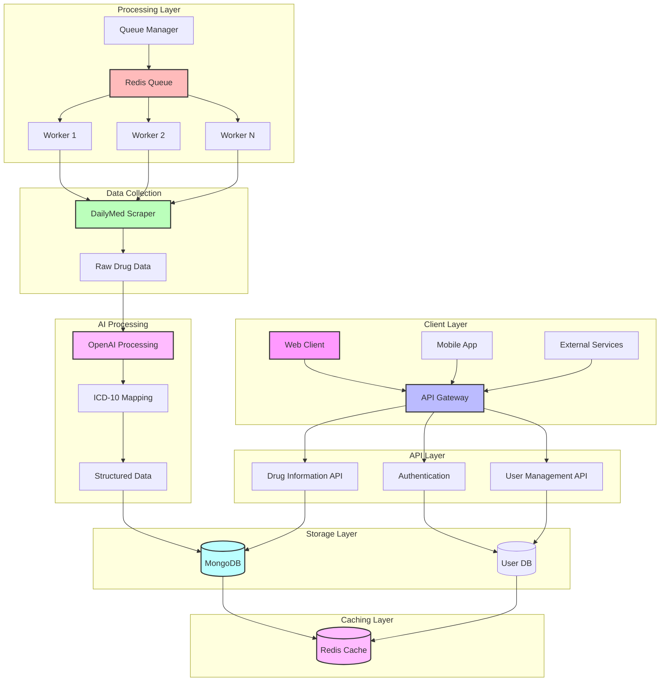
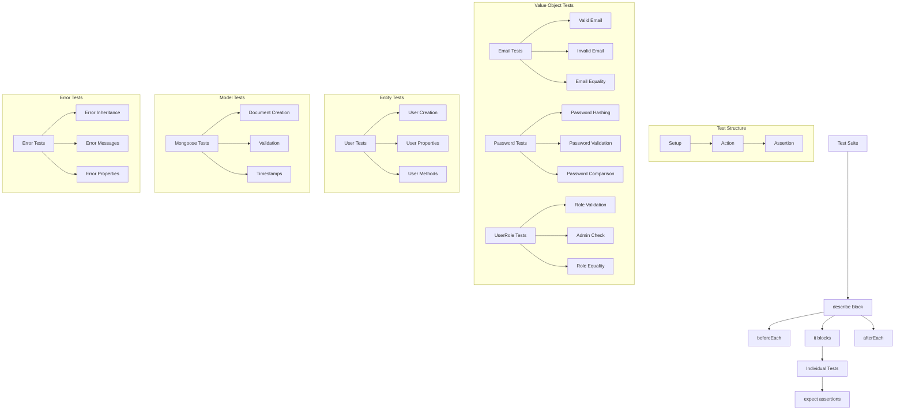

# DailyMed API

A RESTful API for managing drug information with user authentication and role-based access control.

## System Architecture



### System Flow Description

1. **Client Layer**
   - Web clients, mobile apps, and external services interact with the API
   - All requests go through the API Gateway for routing and rate limiting

2. **API Layer**
   - **Authentication API**: Handles user registration, login, and JWT management
   - **Drug Information API**: Provides endpoints for drug data access
   - **User Management API**: Manages user roles and permissions

3. **Processing Layer**
   - **Queue Manager**: Distributes drug data processing tasks
   - **Redis Queue**: Manages job distribution and worker coordination
   - **Workers**: Multiple worker processes for parallel data processing
     - Each worker can handle multiple tasks
     - Auto-scaling based on queue size

4. **Data Collection**
   - **DailyMed Scraper**: Extracts drug information from DailyMed
   - Handles rate limiting and retry logic
   - Stores raw data for processing

5. **AI Processing**
   - **OpenAI Integration**: Processes drug indications
   - **ICD-10 Mapping**: Maps indications to standardized codes
   - Generates structured, queryable data

6. **Storage Layer**
   - **MongoDB**: Stores processed drug data and mappings
   - **User Database**: Manages user accounts and roles
   - Implements data validation and indexing

7. **Caching Layer**
   - **Redis Cache**: Improves response times
   - Caches frequently accessed data
   - Manages session data

### Scalability Features

- **Horizontal Scaling**
  - Multiple API instances behind load balancer
  - Worker pool auto-scaling
  - Distributed caching

- **Performance Optimization**
  - Asynchronous processing
  - Data caching
  - Connection pooling
  - Rate limiting

- **Reliability**
  - Queue-based processing
  - Retry mechanisms
  - Error handling
  - Data validation

- **Security**
  - JWT authentication
  - Role-based access control
  - Rate limiting
  - Input validation

## Features

- User authentication (register/login)
- Role-based access control (admin/normal users)
- Drug information management
- RESTful API with Swagger documentation
- MongoDB database integration
- Redis caching
- JWT authentication
- Input validation
- Error handling

## Prerequisites

- Node.js (v18 or higher)
- MongoDB (v6 or higher)
- Redis (v7 or higher)
- npm or yarn

## Development Setup

1. Clone the repository:
```bash
git clone <repository-url>
cd dailymed
```

2. Install dependencies:
```bash
npm install
# or
yarn install
```

3. Create a `.env` file in the root directory:
```bash
cp .env.example .env
```

4. Configure the environment variables in `.env`:
```env
# Server
PORT=3000
NODE_ENV=development

# MongoDB
MONGODB_URI=mongodb://localhost:27017/dailymed

# Redis
REDIS_HOST=localhost
REDIS_PORT=6379

# JWT
JWT_SECRET=your-secret-key-here

# OpenAI (if using AI features)
OPENAI_API_KEY=your-openai-api-key
```

5. Start the development server:
```bash
npm run dev
# or
yarn dev
```

The server will start at `http://localhost:3000` (or the port specified in your `.env`).

## Testing

### Test Flow Diagram



### Test Execution Flow

1. **Test Suite Initialization**
   - Jasmine loads all test files
   - Sets up test environment
   - Configures mocks and spies

2. **Test Suite Execution**
   - `beforeEach` runs before each test
   - Individual tests execute
   - `afterEach` runs after each test
   - Results are collected

3. **Assertion Types**
   - Equality checks (`toBe`, `toEqual`)
   - Truthiness checks (`toBeTruthy`, `toBeFalsy`)
   - Exception checks (`toThrow`)
   - Instance checks (`toBeInstanceOf`)
   - Async checks (`async/await`)

4. **Mocking Strategy**
   - External services (Redis, OpenAI)
   - Database operations
   - UUID generation
   - JWT operations

### Running Tests

1. Make sure MongoDB is running locally or update the `MONGODB_URI` in your `.env` file.

2. Run all tests:
```bash
npm test
# or
yarn test
```

3. Run tests with coverage:
```bash
npm run test:coverage
# or
yarn test:coverage
```

4. Run tests in watch mode (useful during development):
```bash
npm run test:watch
# or
yarn test:watch
```

### Test Structure

- `src/tests/infra/` - Infrastructure tests
  - `entities/` - Entity tests
  - `value-objects/` - Value object tests
  - `models/` - Mongoose model tests
  - `errors/` - Error class tests
  - `services/` - Service tests
  - `repositories/` - Repository tests
  - `middleware/` - Middleware tests
  - `controllers/` - Controller tests

### Test Environment

The test environment uses:
- A separate MongoDB database (specified in `MONGODB_URI`)
- Mocked Redis connections
- Mocked external services
- Environment variables from `.env.test` (if present) or `.env`

## API Documentation

Once the server is running, you can access the Swagger documentation at:
```
http://localhost:3000/api-docs
```

## Available Scripts

- `npm run dev` - Start development server with hot reload
- `npm run build` - Build the project
- `npm start` - Start production server
- `npm test` - Run tests
- `npm run test:coverage` - Run tests with coverage report
- `npm run test:watch` - Run tests in watch mode
- `npm run lint` - Run ESLint
- `npm run lint:fix` - Fix ESLint issues
- `npm run format` - Format code with Prettier

## Project Structure

```
src/
├── domain/           # Domain layer
│   ├── entities/     # Domain entities
│   ├── errors/       # Domain errors
│   └── value-objects/# Value objects
├── infra/           # Infrastructure layer
│   ├── models/      # Mongoose models
│   ├── repositories/# Repository implementations
│   ├── services/    # External services
│   └── middleware/  # Express middleware
└── presentation/    # Presentation layer
    └── api/         # API routes and controllers
```

## Contributing

1. Create a new branch for your feature
2. Make your changes
3. Write or update tests
4. Run tests and ensure they pass
5. Submit a pull request

## License

[MIT License](LICENSE)